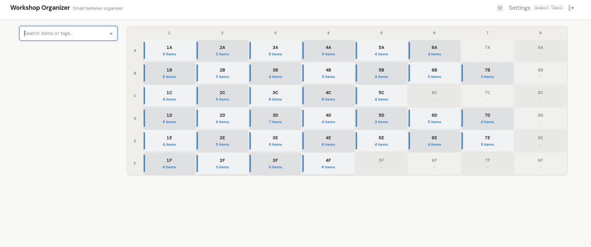
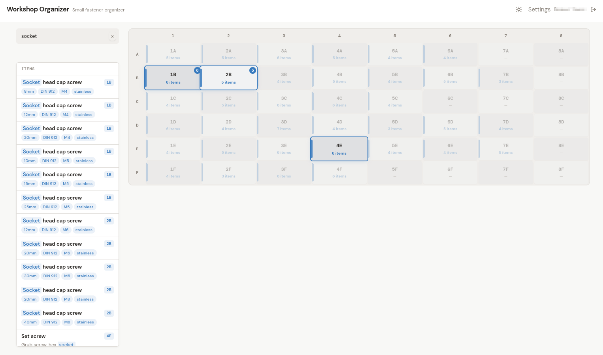

# Screws Box

A web application for managing hardware organizer boxes. Quickly find which container holds your screws, bolts, washers, and other small parts.



Type a part name or tag and instantly see which grid position (e.g., "3B") holds it.

> **Grid View:** A chessboard-style grid showing labeled containers (e.g., "1A", "3B") with item counts. The search bar sits above the grid. Each cell is clickable to view or add items.



## Table of Contents

- [Quick Start](#quick-start)
- [Configuration](#configuration)
- [Deployment](#deployment)
- [Usage Guide](#usage-guide)
- [Admin Panel](#admin-panel)
- [Development](#development)
- [Troubleshooting](#troubleshooting)

## Quick Start

**Prerequisites:** Go 1.22+

```bash
git clone <repo-url>
cd screws-box
go build -o screws-box ./cmd/screwsbox
./screws-box
```

Open [http://localhost:8080](http://localhost:8080) in your browser.

On first launch, you will be prompted to create admin credentials (username and password). These are stored in the local SQLite database.

To use a different port:

```bash
PORT=3000 ./screws-box
```

## Configuration

All configuration is done through environment variables. See [`.env.example`](.env.example) for a ready-to-use template.

### Core

| Variable | Required | Default | Description |
|----------|----------|---------|-------------|
| `PORT` | No | `8080` | HTTP listen port |
| `DB_PATH` | No | `./screws_box.db` | Path to SQLite database file |

### Sessions

| Variable | Required | Default | Description |
|----------|----------|---------|-------------|
| `SESSION_TTL` | No | `24h` | Session expiry duration (Go duration format: `1h`, `30m`, `72h`) |
| `REDIS_URL` | No | _(none)_ | Redis connection URL for session storage (e.g., `redis://localhost:6379`) |

When `REDIS_URL` is not set, sessions are stored in memory and do not survive restarts.

### OIDC

| Variable | Required | Default | Description |
|----------|----------|---------|-------------|
| `OIDC_ISSUER` | No | _(none)_ | OIDC provider issuer URL |
| `OIDC_CLIENT_ID` | No | _(none)_ | OIDC client identifier |
| `OIDC_CLIENT_SECRET` | No | _(none)_ | OIDC client secret |
| `OIDC_DISPLAY_NAME` | No | _(none)_ | Display name for OIDC provider on login page |

**Note:** OIDC environment variables are seed-only. They populate the database on first run when no OIDC config exists. After initial setup, configure OIDC from the admin panel.

### CLI Flags

| Flag | Description |
|------|-------------|
| `--disable-auth` | Clears stored auth credentials. Use if locked out of the admin account. |

Usage:

```bash
./screws-box --disable-auth
```

## Deployment

### Binary + Systemd

Build the binary:

```bash
go build -o screws-box ./cmd/screwsbox
```

Set up the service:

1. Copy the binary and create a data directory:

   ```bash
   sudo mkdir -p /opt/screws-box
   sudo cp screws-box /opt/screws-box/
   sudo cp .env.example /opt/screws-box/.env
   ```

2. Edit `/opt/screws-box/.env` with your settings.

3. Create a dedicated service user:

   ```bash
   sudo useradd --system --no-create-home --shell /usr/sbin/nologin screwsbox
   sudo chown -R screwsbox:screwsbox /opt/screws-box
   ```

4. Create the systemd unit file at `/etc/systemd/system/screws-box.service`:

   ```ini
   [Unit]
   Description=Screws Box - Hardware Organizer
   After=network.target

   [Service]
   Type=simple
   User=screwsbox
   Group=screwsbox
   WorkingDirectory=/opt/screws-box
   ExecStart=/opt/screws-box/screws-box
   EnvironmentFile=/opt/screws-box/.env
   Restart=on-failure
   RestartSec=5
   NoNewPrivileges=true
   ProtectSystem=strict
   ReadWritePaths=/opt/screws-box

   [Install]
   WantedBy=multi-user.target
   ```

5. Enable and start:

   ```bash
   sudo systemctl daemon-reload
   sudo systemctl enable --now screws-box
   ```

6. Check status:

   ```bash
   sudo systemctl status screws-box
   journalctl -u screws-box -f
   ```

### Docker

**Using pre-built image:**

Run the latest release from GitHub Container Registry:

```bash
docker run -p 8080:8080 ghcr.io/richie-tt/screws-box:v1.4.1
```

To persist data, mount a volume for the database:

```bash
docker run -p 8080:8080 -v $(pwd)/data:/data -e DB_PATH=/data/screws_box.db ghcr.io/richie-tt/screws-box:v1.4.1
```

**Build and run with Docker Compose:**

```bash
docker compose up -d
```

This starts Screws Box on port 8080 (configurable via `PORT` in `.env`). The SQLite database is stored in the `./data` directory on the host.

**With Redis sessions:**

```bash
docker compose --profile redis up -d
```

When using the Redis profile, add `REDIS_URL=redis://redis:6379` to your `.env` file so the application connects to the Redis container.

**Notes:**

- The `./data` directory on the host maps to `/data` in the container. SQLite requires this volume to be writable.
- Configuration can be placed in a `.env` file next to `docker-compose.yml`. The compose file loads it automatically (and works fine without one).
- To rebuild after code changes: `docker compose build && docker compose up -d`

## Usage Guide

### Grid

The main interface is a grid representing your physical organizer. Columns are numbered and rows are lettered, forming coordinates like "3B" (column 3, row B).

```
     1    2    3    4    5
   +----+----+----+----+----+
A  |    |    | 3A |    |    |
   +----+----+----+----+----+
B  |    |    | 3B |    |    |
   +----+----+----+----+----+
C  |    |    |    |    |    |
   +----+----+----+----+----+
```

Columns are numbered (1-5), rows are lettered (A-C). Container "3B" is column 3, row B.

> **Grid View:** Containers displayed as labeled cells with item counts. Click any cell to view its contents or add new items.

**Adding items:**

1. Click any cell on the grid to open it.
2. Click "Add Item" in the container panel.
3. Enter a name (e.g., "M6 washer"), an optional description, and tags (e.g., `m6`, `washer`, `spring`).
4. Save. The item now lives in that container.

Each container can hold multiple items. The grid cell shows how many items are inside.

### Search

Type in the search bar at the top to find items by name, description, or tag. As you type, matching containers highlight on the grid so you can quickly spot where a part is stored.

> **Search:** Matching containers highlight on the grid as you type. Results show item names, tags, and container positions.

**Multi-tag filtering:** Select tags from the filter dropdown to narrow results. When multiple tags are selected, only items matching ALL selected tags are shown.

### Export and Import

- **Export:** Go to Admin > Export to download a JSON backup of all your data (shelf configuration, containers, items, and tags).
- **Import:** Go to Admin > Import to upload a JSON file. The app validates the data first and shows a confirmation before applying changes.

## Admin Panel

Access the admin panel via the "Admin" link in the header (visible when logged in).

> **Admin Panel:** A settings hub with sections for shelf configuration, authentication, OIDC setup, data export/import, and session management.

The admin panel includes:

- **Shelf Settings** -- Resize the grid or rename the shelf. Resizing warns if containers with items would be removed.
- **Auth Settings** -- Change the admin username and password.
- **OIDC Configuration** -- Set up single sign-on with an OpenID Connect provider.
- **Sessions** -- View active sessions, revoke individual sessions, or revoke all sessions.
- **Export / Import** -- Back up and restore data as JSON.

### OIDC Setup

Screws Box supports any standard OpenID Connect provider that publishes a discovery document at `/.well-known/openid-configuration`. Configure the redirect URI as:

```
http://<host>:<port>/auth/callback
```

Request the following scopes: `openid profile email`.

#### Authelia (Example)

[Authelia](https://www.authelia.com/) is a popular self-hosted authentication server. To connect it with Screws Box:

1. In your Authelia `configuration.yml`, add an OIDC client:

   ```yaml
   identity_providers:
     oidc:
       clients:
         - client_id: screws-box
           client_secret: '<generate with: openssl rand -hex 32>'
           redirect_uris:
             - http://<screws-box-host>:8080/auth/callback
           scopes:
             - openid
             - profile
             - email
           authorization_policy: one_factor
   ```

2. In Screws Box, go to **Admin > OIDC Configuration**.

3. Fill in:
   - **Issuer URL:** `https://auth.example.com` (your Authelia domain)
   - **Client ID:** `screws-box`
   - **Client Secret:** the secret you generated
   - **Display Name:** `Authelia` (shown on the login page button)

4. Save and test by clicking the SSO button on the login page.

### Sessions

View all active sessions under **Admin > Sessions**. Each entry shows the session creation time and type (local or OIDC).

- **Revoke a single session** by clicking the revoke button next to it.
- **Revoke all other sessions** to sign out everywhere except your current session.

With Redis configured, sessions persist across application restarts. Without Redis, all sessions are lost on restart.

## Development

### Prerequisites

- Go 1.22+ (the project uses Go 1.26.1; any 1.22+ should work)

### Build

```bash
go build -o screws-box ./cmd/screwsbox
```

### Dev Mode

Dev mode reads templates and static files from disk, so changes are reflected without rebuilding:

```bash
go run -tags dev ./cmd/screwsbox
```

### Tests

```bash
go test ./... -count=1
```

### Lint

A `.golangci.yml` configuration is included. Run with:

```bash
golangci-lint run ./...
```

### Key Dependencies

| Package | Purpose |
|---------|---------|
| [chi v5](https://github.com/go-chi/chi) | HTTP router (stdlib-compatible) |
| [modernc.org/sqlite](https://pkg.go.dev/modernc.org/sqlite) | CGo-free SQLite driver |
| [go-oidc v3](https://github.com/coreos/go-oidc) | OpenID Connect client |
| [go-redis v9](https://github.com/redis/go-redis) | Redis client for session storage |

### API Routes

**Public:**

| Method | Path | Description |
|--------|------|-------------|
| `GET` | `/healthz` | Health check |
| `GET` | `/login` | Login page |
| `POST` | `/login` | Login form submission |
| `GET` | `/logout` | Logout |
| `GET` | `/auth/oidc` | Start OIDC login flow |
| `GET` | `/auth/callback` | OIDC callback |

**Protected (requires authentication):**

| Method | Path | Description |
|--------|------|-------------|
| `GET` | `/` | Grid page (main UI) |
| `GET` | `/settings` | Settings panel |
| `GET/POST` | `/api/items` | List / create items |
| `GET/PUT/DELETE` | `/api/items/{id}` | Get / update / delete item |
| `POST` | `/api/items/{id}/tags` | Add tag to item |
| `DELETE` | `/api/items/{id}/tags/{tag}` | Remove tag from item |
| `GET` | `/api/tags` | List all tags |
| `PUT` | `/api/tags/{id}` | Rename tag |
| `DELETE` | `/api/tags/{id}` | Delete unused tag |
| `GET` | `/api/search` | Search items |
| `GET` | `/api/containers/{id}/items` | List items in container |
| `PUT` | `/api/shelf/resize` | Resize grid |
| `GET/PUT` | `/api/shelf/auth` | Auth settings |
| `GET/PUT` | `/api/oidc/config` | OIDC configuration |
| `GET` | `/api/export` | Export all data as JSON |
| `POST` | `/api/import/validate` | Validate import data |
| `POST` | `/api/import/confirm` | Confirm and apply import |
| `GET` | `/api/duplicates` | Find duplicate items across containers |
| `GET/DELETE` | `/api/sessions` | List / revoke all sessions |
| `DELETE` | `/api/sessions/{id}` | Revoke single session |

## Troubleshooting

### Port 8080 is already in use

Set a different port:

```bash
PORT=3000 ./screws-box
```

In Docker, update the `PORT` variable in your `.env` file.

### "database is locked" or "unable to open database file"

Ensure the database directory is writable. SQLite needs write access for WAL journal files. In Docker, the volume mount must be writable.

### "x509: certificate signed by unknown authority"

The Docker image needs CA certificates for OIDC HTTPS calls. Ensure the Dockerfile includes:

```dockerfile
COPY --from=build /etc/ssl/certs/ca-certificates.crt /etc/ssl/certs/
```

This is already included in the shipped Dockerfile.

### App exits immediately with Redis error

Redis must be running before starting Screws Box. If you set `REDIS_URL` but Redis is not available, the app will exit immediately.

To fall back to in-memory sessions, remove the `REDIS_URL` environment variable.

### Changed OIDC env vars but nothing happened

OIDC env vars only apply on first run when no OIDC configuration exists in the database. Use the admin panel to update OIDC configuration after initial setup.
